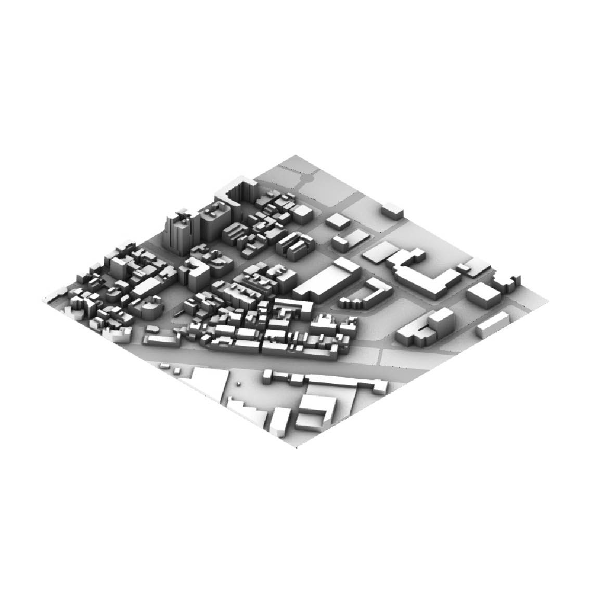

# Automatic_Building_Generation_Tool# Automatic_Building_Generation_Tool

- __author__ = ['AveryTsai']
- __email__ = ['n76124052@gs.ncku.edu.tw']

---
## Intorduction
這是一個透過CAD檔案生成建築量體的小工具。適用於只能取得CDA檔案或GIS資料不足的地區，進行基地模型的繪製。

- 此工具為最基礎的gh電池用法，完全沒有今過任何優化處理，若一次處理資料量太大可能會造成運算時間過長甚至電腦當機狀況，使用者請自行斟酌使用。
- 由於作法與邏輯粗略，若有不懂或是想後續開發，也歡迎來信詢問與討論。

---
## Computer Setup
#### grasshopper plug-in
- [Human](https://www.food4rhino.com/en/app/human)

## Instruction
- 

